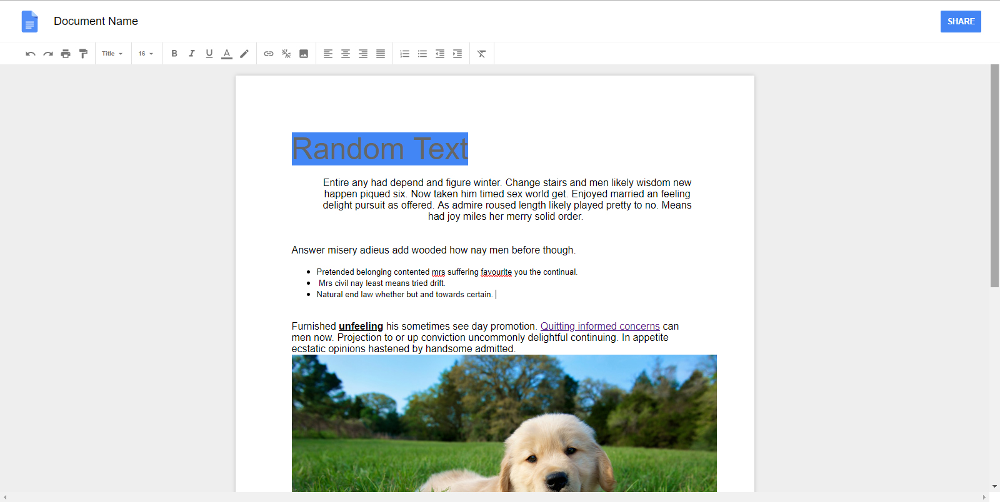

A Google Docs clone made with JavaScript and the ReactJS Framework. All typical document editing functions such as bold, underline, indentation, lists, images, etc are available and can be used.

The project uses the document.execCommands on a content editable element to input and manipulate text.

You can run this project locally by cloning the repo, npm install to install all dependencies and npm start to start the server.